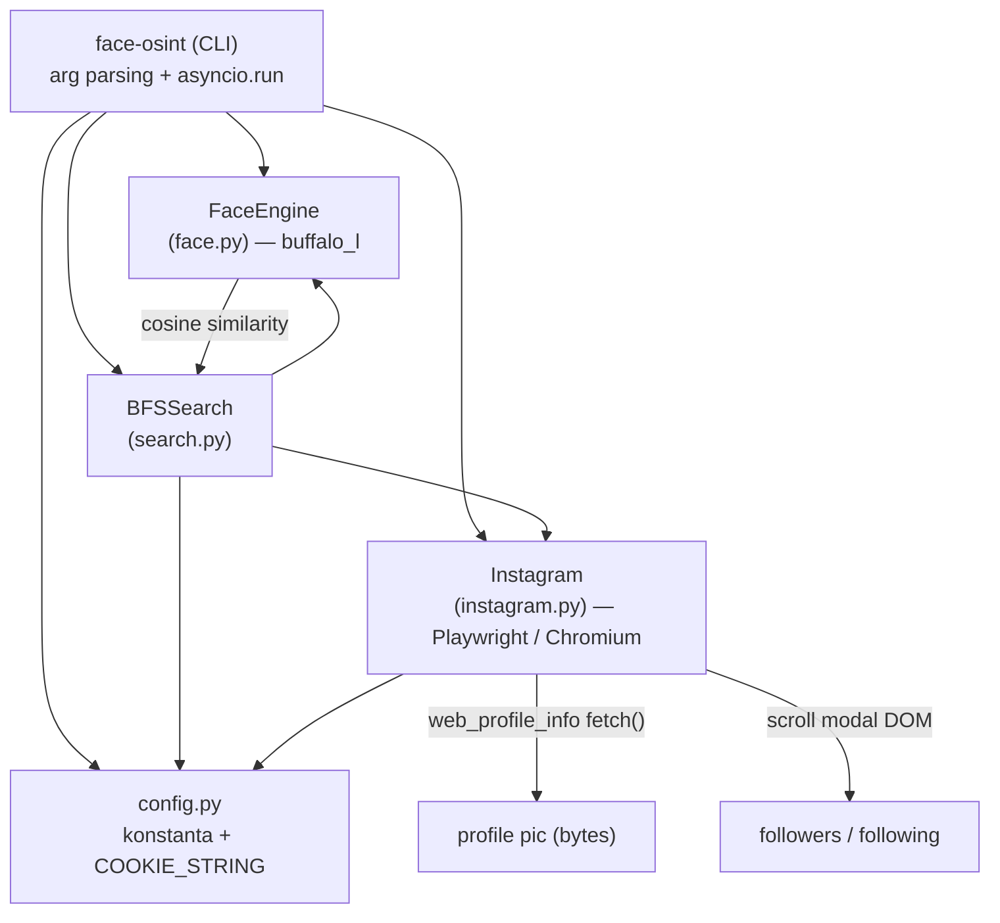
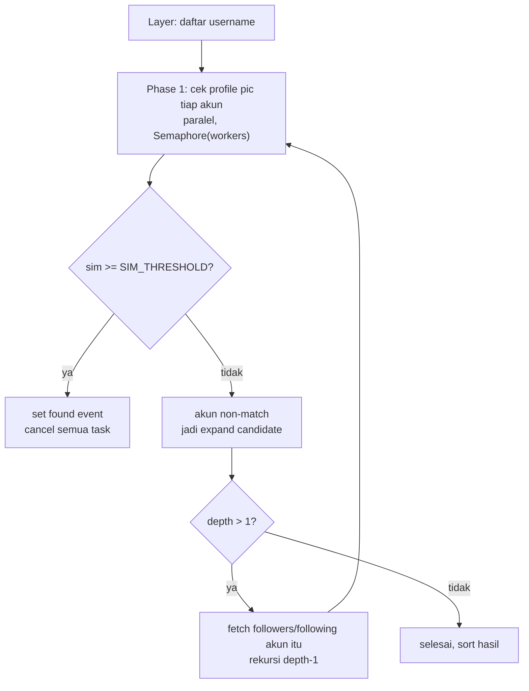

# Arsitektur

Dokumen ini untuk developer/kontributor. Untuk cara pakai, lihat [penggunaan.md](penggunaan.md).

## Gambaran umum

Empat modul di bawah `modules/`, diorkestrasi oleh script top-level `face-osint` yang menangani arg parsing dan event loop async (`asyncio.run`).

> **Constraint desain:** scraping **wajib** lewat Playwright (browser context Chromium). Semua request Instagram (navigasi, `fetch()`, download gambar) berjalan di dalam browser context memakai cookie session asli. **Jangan** menggantinya dengan raw HTTP client (`requests`/`httpx`) — itu langsung terdeteksi di lapisan TLS/fingerprint. Lihat [keamanan-dan-rate-limit.md](keamanan-dan-rate-limit.md).

## `face.py` — FaceEngine

Membungkus insightface `buffalo_l`.

- Load model sekali (`ctx_id=0`, CPU; ~150MB unduhan first-run).
- Menghasilkan embedding dari bytes (`get_embedding`) atau path file (`get_embedding_from_path`).
- `compare()` = cosine similarity dua embedding (float 0–1).
- `compare_to_ref(img_bytes, ref_emb)` dipakai di jalur search.
- Engine di-instantiate sekali di CLI lalu dioper ke `BFSSearch`, supaya model tidak di-reload per worker.

## `instagram.py` — Instagram (Playwright)

Scraper async Playwright, dipakai sebagai async context manager: `async with Instagram(cookie) as ig:`.

**Poin desain kunci:**

- **Single shared browser** untuk semua instance `Instagram` (variabel module-level `_browser`/`_pw`, dijaga `ensure_browser()` di bawah `asyncio.Lock`). Tiap instance membuka context+page sendiri. **Caller wajib memanggil `close_shared_browser()` sekali di akhir** — setiap command melakukannya sebelum return.
- **Followers/following = scrape modal DOM** (`_scrape_modal` men-scroll dialog followers), **bukan** private API. Method `_api_followers`/`_api_following` masih ada tapi **dead code** — `get_followers`/`get_following` route ke jalur page-based `_page_followers`/`_page_following`. Modal scrape cap 100 followers / 500 following, berhenti dini saat stall atau ketemu section "Suggested for you".
- **Foto profil** via API `web_profile_info` lewat `fetch()` dalam page, dengan CSRF token diambil dari cookie; byte gambar diunduh via `page.request.get()`.
- `_goto_with_retry` melakukan exponential backoff pada 429. `skip_home=True` melewati navigasi homepage awal (dipakai worker search untuk hemat waktu/request).

## `search.py` — BFSSearch

Mesin rekursif. Layer 0 = followers + following target (dedup). Tiap layer:

1. **Phase 1:** cek foto profil tiap akun terhadap referensi secara konkuren, dibatasi `Semaphore(workers)`. Dedup lewat set `checked_users`/`checked_urls` di bawah `asyncio.Lock`. Akun pertama yang mencapai `SIM_THRESHOLD` men-set `self.found` dan men-short-circuit semuanya.
2. **Phase 2** (hanya jika `depth > 1`): akun yang *tidak* match jadi expand candidate — fetch followers/following *mereka* lalu rekursi pada `depth-1`. Set `expanded_users` mencegah expand ganda.

- **Threshold coupling:** cutoff match saat search adalah `config.SIM_THRESHOLD`, **bukan** nilai `--threshold` CLI. `--threshold` hanya memengaruhi print summary/marker `<<<` di `face-osint`.
- Hasil (semua wajah terdeteksi + top-50) ditulis ke `RESULTS_DIR/face_search_result.json`. Field: `found`, `match`, `threshold`, `total_checked`, `total_faces`, `total_face_checks`, `top_50`.

## `config.py`

Konstanta (`MODEL_NAME`, `SIM_THRESHOLD`, `WORKERS`, `PLAYWRIGHT_TIMEOUT`, `PAGE_WAIT`, `MAX_DEPTH`) dan `COOKIE_STRING`. Juga membuat + mendefinisikan `DATA_DIR`/`RESULTS_DIR`.

- **Path gotcha:** `CONFIG_DIR = dirname(config.py)` = folder `modules/`, jadi `DATA_DIR` = `modules/data/` dan `RESULTS_DIR` = `modules/results/` — bukan root repo.
- Catatan: `PAGE_WAIT = 1500` didefinisikan tapi **tidak pernah dipakai** (knob mati).

## Alur eksekusi (ringkas)

1. `main()` di `face-osint` → `resolve_cookie()` (strip flag cookie global dari `sys.argv`).
2. Dispatch ke handler command (`cmd_search`/`cmd_scrape`/`cmd_pic` async; `cmd_compare`/`cmd_list` sync).
3. Untuk `search`: load FaceEngine → embedding referensi → load/scrape layer 0 → `BFSSearch.search(layer0, depth)` → print top-N + hasil → `close_shared_browser()`.
